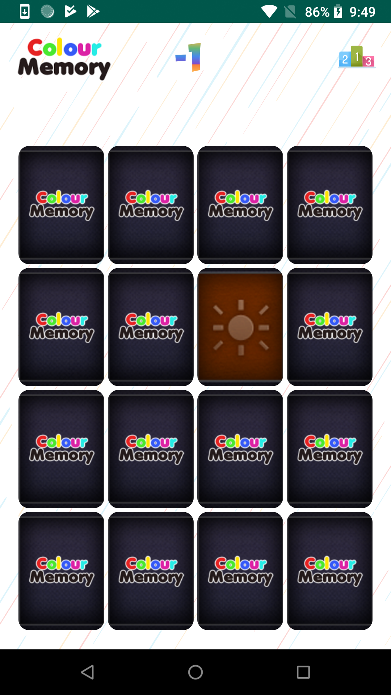
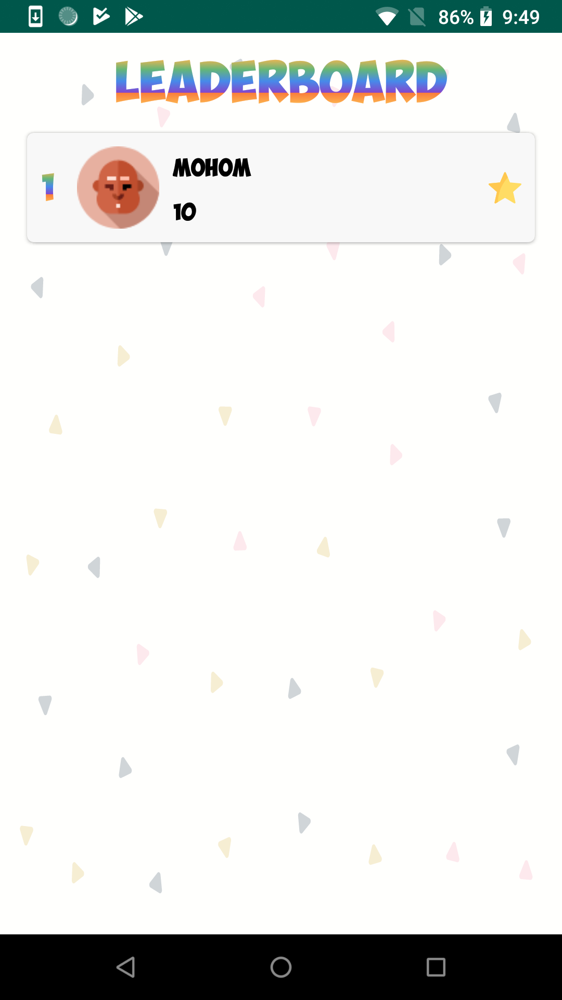
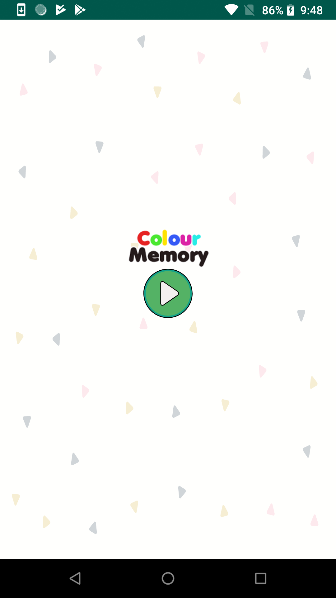

Memory Game
===================================

This is a game to match two cards from the board. All the cards are initially
flipped down. User needs to click on the card and card is flipped and same card
needs to be flipped again.

If the card matches the correct card, then 2 points are added to the players 
score otherwise one point is deducted. (Scores can go into negative).

Introduction
------------

There are four rows and four columns in a board where there are sixteen cards.
These all cards initially flipped downwards.

Pre-requisites
--------------

- Android SDK 28
- Android Build Tools v28.0.0
- Android Support Repository

Screenshots
-------------

 
 
 
